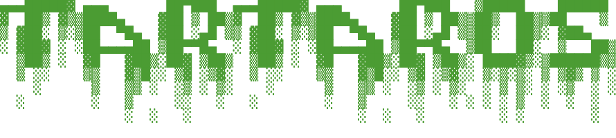

<h1 align="center">
Reconnaissance tool written in Rust.
</h1>

<p align="center">
  <br/>
  
</p>


## Installation

### Install Rust (if needed)
```bash
curl https://sh.rustup.rs -sSf | sh
```
### Install Tartaros
```bash
git clone https://github.com/Mickdep/Tartaros.git
cd Tartaros
cargo build --release
```


## Usage

```
tartaros <ip_address>
```


## Demo

**In development**

## Configuration

**In development**